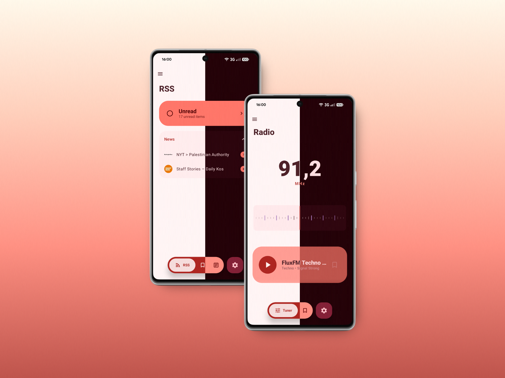
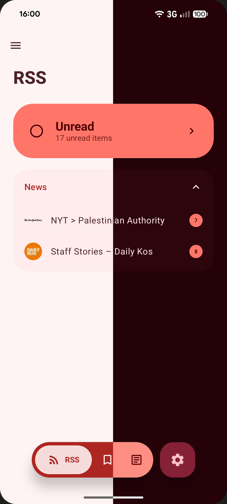
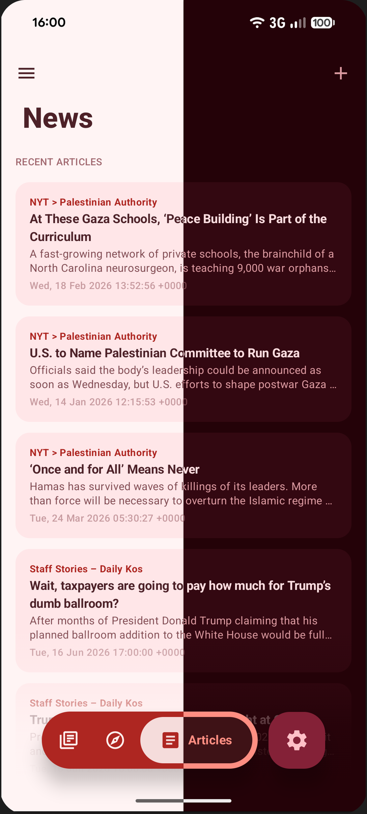
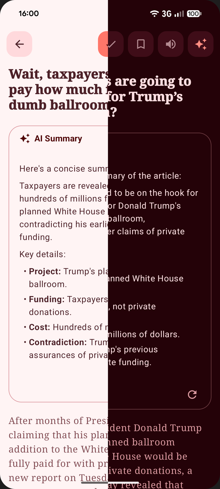
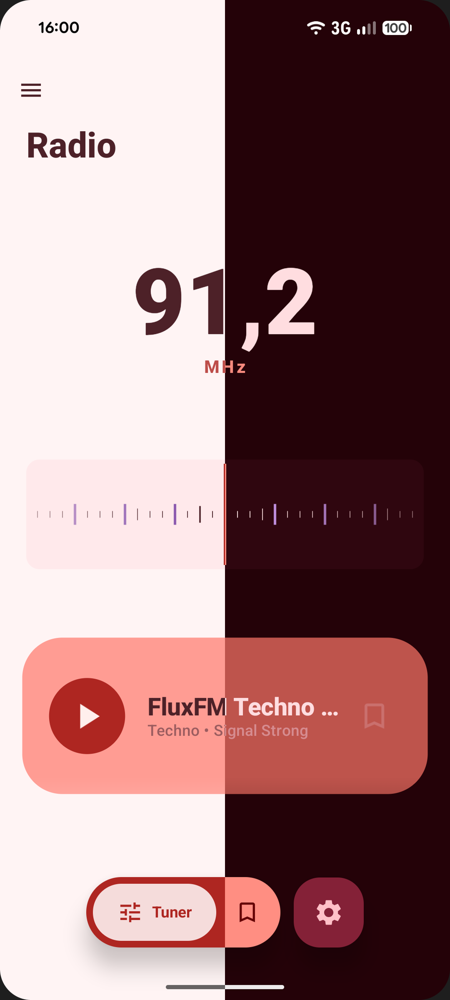

# Lura — Dein smarter Begleiter für Nachrichten und Radio

Lura ist eine moderne Android-App, die RSS-Feeds, tagesaktuelle Nachrichten und Internetradio mit modernster KI-Technologie vereint. Entwickelt mit **Jetpack Compose** und **Material 3**, bietet Lura eine elegante und hochgradig anpassbare Benutzererfahrung.



## ✨ Funktionen

### 📰 Intelligenter RSS-Reader & News
Bleib immer auf dem Laufenden. Lura importiert deine Lieblings-Feeds und bietet dir eine saubere, werbefreie Leseumgebung.
- **Clean View**: Fokus auf den Text, ohne störende Elemente.
- **News-Verwaltung**: Folge großen Zeitungen oder füge eigene RSS-Quellen hinzu.
- **Offline-Lesen**: Speichere Artikel für später.

 
*Home-Bildschirm und News-Übersicht*

### 🤖 KI-Power (Summarizer)
Keine Zeit, lange Artikel zu lesen? Lura nutzt **Google Gemini** oder **On-Device-Modelle** (via Hugging Face), um dir prägnante Zusammenfassungen zu erstellen.
- **Gemini Pro/Flash**: High-End-KI in der Cloud.
- **On-Device AI**: Maximale Privatsphäre durch lokale Verarbeitung mit `.litertlm` Modellen.


*Artikelansicht mit KI-Zusammenfassung*

### 📻 Nostalgisches Internetradio
Erlebe Radio neu. Lura kombiniert globales Internetradio mit einem klassischen Tuner-Feeling.
- **Weltweite Sender**: Suche nach Region oder Genre.
- **Rausch-Simulation**: Authentisches Feedback beim Suchen von Sendern.
- **Sleep-Timer & Favoriten**: Deine Lieblingssender immer griffbereit.


*Interaktives Radio mit Frequenz-Tuner*

### 🎨 Design & Anpassung
- **Material 3 & Dynamic Color**: Passt sich farblich deinem System an (Android 12+).
- **Pitch Black Mode**: Echter Schwarzmodus für OLED-Displays zur Akkuschonung.
- **Barrierefreiheit**: Einstellbare Schriftgrößen, Zeilenabstände und Text-to-Speech (Vorlesefunktion).

## 🛠 Tech Stack

- **UI**: Jetpack Compose mit Material 3
- **Architektur**: MVVM (ViewModel, Repository, Coroutines, Flow)
- **Datenbank**: Room (SQLite) für lokale Speicherung
- **Hintergrund**: WorkManager für automatische Feed-Aktualisierungen
- **KI-Integration**: Google Generative AI SDK & Media3 LiteRT (für lokale Modelle)
- **Bildverarbeitung**: Coil & Palette API (dynamische Farben aus Vorschaubildern)

## 🚀 Installation & Setup

1. **Repository klonen**:
   ```bash
   git clone https://github.com/nino161er/lura.git
   ```
2. **Projekt öffnen**: Importiere das Projekt in Android Studio (Ladybug oder neuer empfohlen).
3. **KI konfigurieren (Optional)**:
   - Hol dir einen API-Key im [Google AI Studio](https://aistudio.google.com/app/apikey).
   - Trage ihn in der App unter **Einstellungen → AI Summarizer** ein.
   - Alternativ: Lade ein lokales Modell via Hugging Face Token direkt in den Einstellungen herunter.

## 📱 Systemvoraussetzungen
- Android 8.0 (API 26) oder höher.
- Für Dynamic Color wird Android 12+ benötigt.

---
Entwickelt von [nino161er](https://github.com/nino161er)
