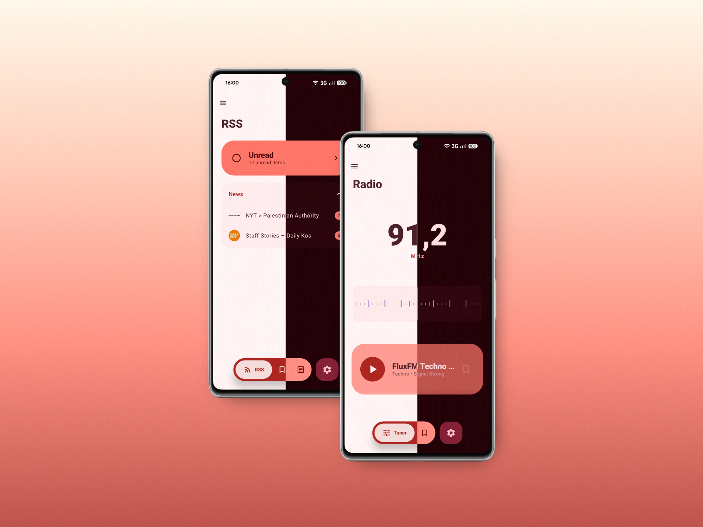
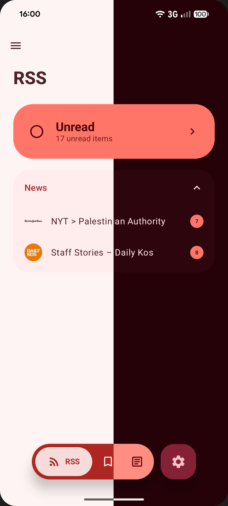
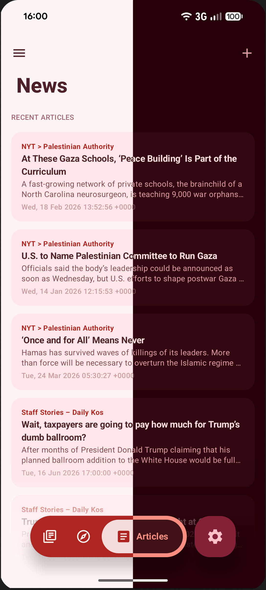
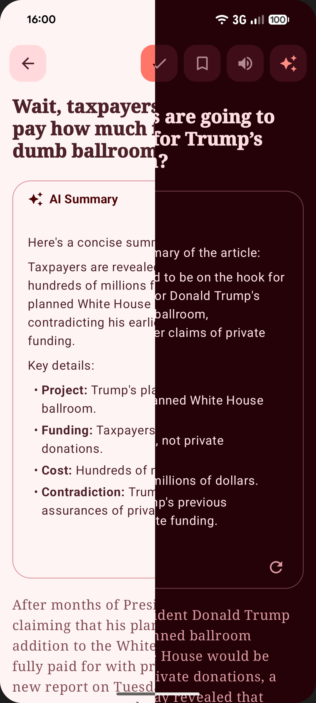
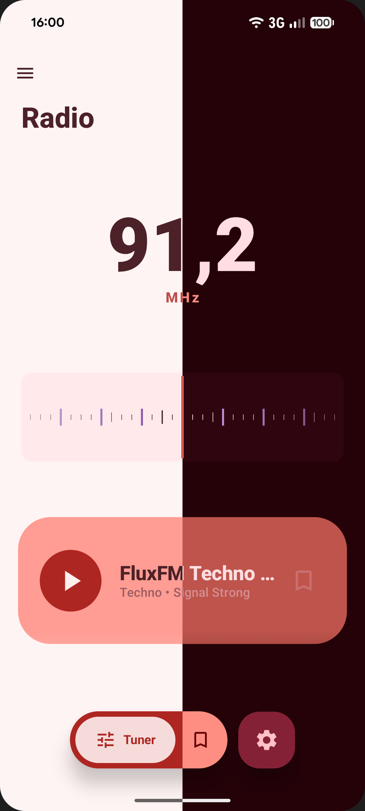

# Lura — Your Smart Companion for News and Radio

Lura is a modern Android app that combines RSS feeds, up-to-date news, internet radio, and modern AI technology. Built with **Jetpack Compose** and **Material 3**, Lura offers an elegant and highly customizable user experience.

<p align="center">
  
</p>

## ✨ Features

### 📰 Smart RSS Reader & News
Stay up to date with the topics you care about. Lura imports your favorite feeds and provides a clean, distraction-free reading experience.
- **Clean View**: Focus on the article without distracting elements.
- **News Management**: Follow major newspapers or add your own RSS sources.
- **Offline Reading**: Save articles for later.

### 🤖 AI-Powered Summaries
No time to read long articles? Lura uses **Google Gemini** or **on-device models** (via Hugging Face) to create concise summaries.
- **Gemini Pro/Flash**: Powerful cloud-based AI.
- **On-Device AI**: Maximum privacy through local processing with `.litertlm` models.

### 📻 Nostalgic Internet Radio
Rediscover radio. Lura combines global internet radio with the feel of a classic tuner.
- **Stations Worldwide**: Search by region or genre.
- **Static Simulation**: Authentic feedback while tuning between stations.
- **Sleep Timer & Favorites**: Keep your favorite stations close at hand.

## 📸 Screenshots

<p align="center">
  
  
  
  
</p>

## 🎨 Design & Customization
- **Material 3 & Dynamic Color**: Adapts to your system colors on Android 12+.
- **Pitch Black Mode**: True black mode for OLED displays to help reduce power usage.
- **Accessibility**: Adjustable font sizes, line spacing, and text-to-speech support.

## 🛠 Tech Stack

- **UI**: Jetpack Compose with Material 3
- **Architecture**: MVVM (ViewModel, Repository, Coroutines, Flow)
- **Database**: Room (SQLite) for local storage
- **Background Work**: WorkManager for automatic feed updates
- **AI Integration**: Google Generative AI SDK & Media3 LiteRT for local models
- **Image Processing**: Coil & Palette API for dynamic colors from preview images

## 🚀 Installation & Setup

1. **Clone the repository**:
   ```bash
   git clone https://github.com/ninocss/Lura.git
   ```
2. **Open the project**: Import the project into Android Studio (Ladybug or newer recommended).
3. **Configure AI (optional)**:
   - Get an API key from [Google AI Studio](https://aistudio.google.com/app/apikey).
   - Enter it in the app under **Settings → AI Summarizer**.
   - Alternatively, download a local model directly from the settings using a Hugging Face token.

## 📱 System Requirements
- Android 8.0 (API 26) or newer.
- Dynamic Color requires Android 12+.

---

Developed by [ninocss](https://github.com/ninocss)
